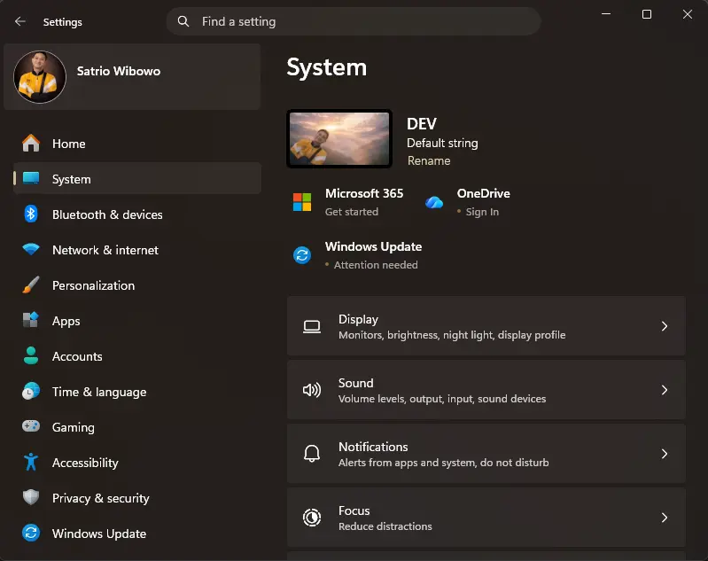
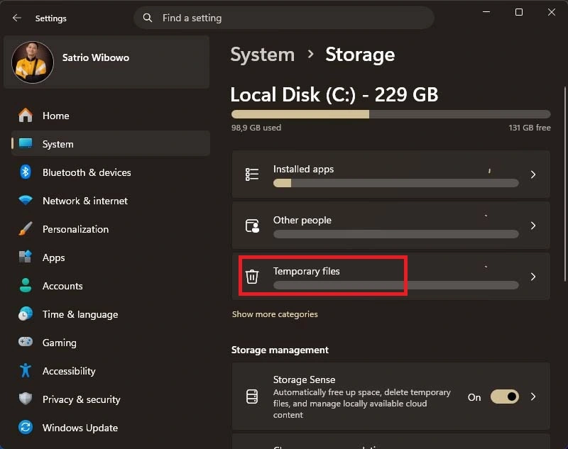
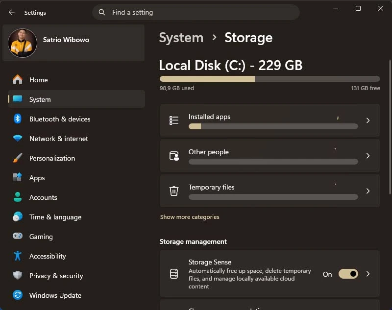

Menghapus *temporary file* (file sampah) di Windows 11 adalah langkah krusial untuk menjaga kinerja laptop tetap responsif dan mengosongkan ruang penyimpanan yang penuh. File-file ini biasanya menumpuk dari sisa pembaruan sistem, *cache* aplikasi, hingga data pencarian internet.

Berikut adalah panduan lengkap cara membersihkan file sampah di Windows 11:

### 1. Cara Tercepat: Melalui Settings (Rekomendasi)
Ini adalah metode paling aman karena Windows akan mengategorikan file mana yang boleh dihapus tanpa merusak sistem.

- Buka **Settings** (Tekan `Win + I`).
- Pilih menu **System** > **Storage**.
- Klik pada opsi **Temporary files**.
- Centang jenis file yang ingin dihapus (seperti *Windows Update Cleanup*, *Temporary Internet Files*, *Recycle Bin*, dll).
- Klik tombol **Remove files** di bagian atas.

### 2. Cara Manual: Menggunakan Folder `%temp%`
Metode ini sangat efektif untuk menghapus file sementara yang ditinggalkan oleh aplikasi pihak ketiga.

- Tekan **Windows + R** secara bersamaan untuk membuka kotak dialog "Run".
- Ketik `%temp%` dan tekan **Enter**.
- Setelah folder terbuka, tekan **Ctrl + A** untuk memilih semua file.
- Tekan **Delete** (atau **Shift + Delete** untuk hapus permanen).
- *Catatan:* Jika muncul peringatan file sedang digunakan, centang **"Do this for all current items"** lalu klik **Skip**.

### 3. Mengaktifkan Storage Sense (Pembersihan Otomatis)
Agar tidak perlu membersihkan secara manual, Anda bisa memanfaatkan fitur asisten otomatis dari Windows.

- Buka **Settings** > **System** > **Storage**.
- Aktifkan sakelar pada opsi **Storage Sense**.
- Anda bisa masuk ke menu tersebut untuk mengatur jadwal pembersihan (misalnya setiap minggu atau setiap bulan).

### 4. Membersihkan System Temp Folder
Berbeda dengan `%temp%`, folder ini berisi file sementara milik sistem operasi.

- Tekan **Windows + R**, ketik `temp` (tanpa tanda %), lalu klik **OK**.
- Hapus semua file di dalam folder tersebut. Anda mungkin memerlukan izin Administrator untuk melakukan ini.

### 5. Melalui Disk Cleanup
Fitur klasik ini masih tersedia dan sangat ampuh untuk pembersihan mendalam.

- Ketik **"Disk Cleanup"** di kolom pencarian Windows (Start Menu).
- Pilih drive **C:** dan klik **OK**.
- Klik tombol **"Clean up system files"** untuk memunculkan opsi pembersihan yang lebih menyeluruh seperti bekas instalasi Windows versi lama.

---

**Tips Tambahan:**
Jika ada _file_ yang tidak bisa dihapus, itu berarti file tersebut sedang digunakan oleh sistem atau aplikasi yang sedang berjalan. Jangan dipaksa, cukup pilih opsi **Skip** untuk melewati file tersebut.

Semoga bermanfaat!
